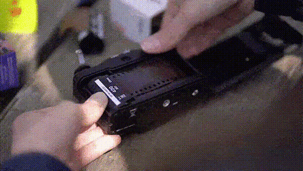

## Hola 👋🏽 I'm Gastón!!

 
 

Most of the time I'm doing this

but sometimes I love to do this. ~~I don't mean reply emails like a psycho~~

### 👨🏻‍💻 More About Me

 Former Database Admin for almost 15 years.

 Actually working in [Casa Rosada](https://www.casarosada.gob.ar/la-casa-rosada/historia) as a photographer.

 In pandemic I came back to my old love for programming. [Al Sweigart](https://alsweigart.com) released his famouse book [Automate The Boring Stuff With Python](https://automatetheboringstuff.com) in form of [udemy-video-tutorial](https://www.udemy.com/course/automate/). Three years later I couldn't stop learning and playing with Python.  
